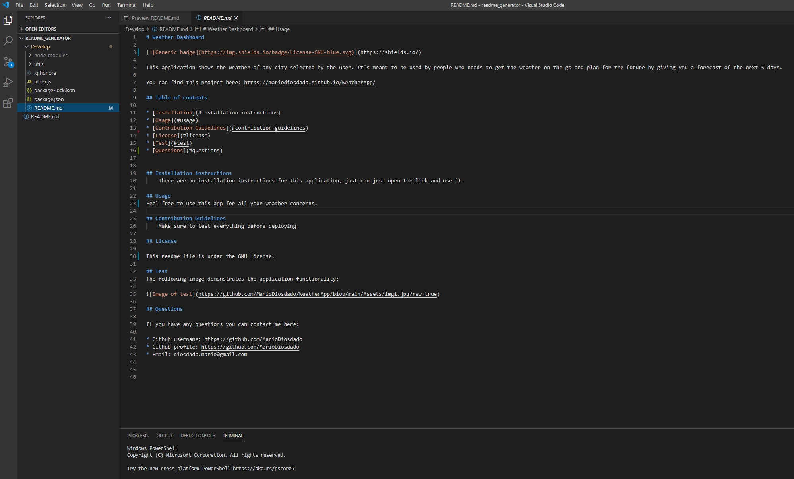

# README generator 

This application generates readme files for the user. It has different sections like description, installation instructions, constributions, tests, questions, etc. It gets all its data from the user by responding simple questions.

You can find this project here: https://github.com/MarioDiosdado/readme_generator

## Table of contents

* [Installation](#installation-instructions)
* [Test](#test)
* [Questions](#questions)
            
            
## Installation instructions
    Install npm inquirer and run the application by typing node index.js on the terminal then answer the questions, at the end the README file will be automatically generated.

## Test
The readme on this image was generated using the application

## Questions

If you have any questions you can contact me here:

* Github username: https://github.com/MarioDiosdado
* Github profile: https://github.com/MarioDiosdado
* Email: diosdado.mario@gmail.com

            